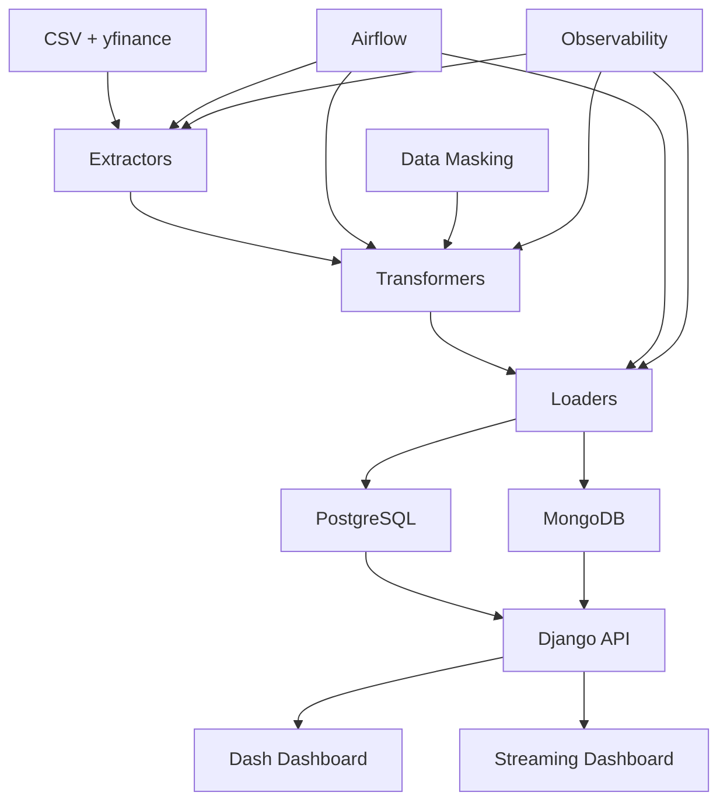

# 🚀 DATA_MASTER_2 - Sistema de Análise de Dados do Mercado de Ações Brasileiro

## 📋 Visão Geral

O **DATA_MASTER_2** é um sistema completo de Engenharia de Dados para análise do mercado de ações brasileiro (B3), demonstrando proficiência em todo o ciclo de vida dos dados: desde a extração até a visualização, passando por transformação, armazenamento, orquestração, observabilidade e segurança.

## 🎯 Objetivos do Projeto

- ✅ **ETL Completo**: Pipeline robusto de Extração, Transformação e Carregamento
- ✅ **Observabilidade**: Logs estruturados, métricas e monitoramento
- ✅ **Segurança**: Autenticação, autorização e mascaramento de dados
- ✅ **Arquitetura Escalável**: Design para crescimento horizontal e vertical
- ✅ **Visualizações Interativas**: Dashboards funcionais e responsivos
- ✅ **Streaming de Dados**: Simulação de dados em tempo real
- ✅ **Documentação Completa**: Reprodução garantida

## 🏗️ Arquitetura



## 🛠️ Stack Tecnológico

### Backend e API
- **Python 3.9+**: Linguagem principal
- **Django 4.2**: Framework web
- **Django REST Framework**: API REST
- **Django CORS Headers**: Cross-origin resource sharing

### Processamento de Dados
- **Pandas 2.0**: Manipulação e análise de dados
- **NumPy 1.24**: Computação numérica
- **yfinance**: Integração com Yahoo Finance

### Banco de Dados
- **PostgreSQL**: Dados históricos processados
- **MongoDB**: Dados de streaming em tempo real
- **SQLAlchemy**: ORM para Python

### Visualização
- **Dash 2.14**: Dashboards interativos
- **Plotly 5.17**: Gráficos e visualizações

### Orquestração
- **Apache Airflow 2.7**: Orquestração de pipelines

### Observabilidade
- **Structlog**: Logging estruturado
- **Métricas customizadas**: Monitoramento de performance

### Segurança
- **Cryptography**: Criptografia de dados
- **Data Masking**: Mascaramento de dados sensíveis

### Containerização
- **Docker**: Containerização da aplicação
- **Docker Compose**: Orquestração de serviços

## 📁 Estrutura do Projeto

```
DATA_MASTER_2/
├── 📊 etl/                          # Pipeline ETL
│   ├── 📥 extractors/              # Extratores de dados
│   │   ├── csv_extractor.py        # Extrator CSV
│   │   ├── yfinance_extractor.py   # Extrator Yahoo Finance
│   │   └── streaming_extractor.py  # Extrator de streaming (NOVO!)
│   ├── 🔄 transformers/            # Transformadores
│   │   ├── data_cleaner.py         # Limpeza de dados
│   │   ├── technical_indicators.py # Indicadores técnicos
│   │   └── data_masking.py         # Mascaramento (NOVO!)
│   ├── 📤 loaders/                 # Carregadores
│   │   ├── postgres_loader.py      # Loader PostgreSQL
│   │   └── mongodb_loader.py       # Loader MongoDB (NOVO!)
│   └── 🎯 dags/                    # DAGs do Airflow
│       └── b3_etl_dag.py          # DAG principal
├── 🎨 dashboard/                    # Aplicação Django
│   ├── 📱 apps/
│   │   ├── dashboard/              # App principal
│   │   │   ├── dash_app.py         # Dashboard principal
│   │   │   ├── streaming_dash_app.py # Dashboard streaming (NOVO!)
│   │   │   ├── etl_views.py        # Views do ETL
│   │   │   └── views.py            # Views gerais
│   │   └── stocks/                 # App de ações
│   │       ├── models.py           # Modelos Django
│   │       ├── serializers.py      # Serializers DRF
│   │       ├── views.py            # Views da API
│   │       └── urls.py             # URLs da API
│   ├── 📋 templates/               # Templates HTML
│   │   └── dashboard/
│   │       ├── home.html           # Dashboard principal
│   │       └── etl_dashboard.html  # Dashboard ETL
│   └── ⚙️ dashboard/               # Configurações Django
│       ├── settings.py             # Configurações
│       ├── urls.py                 # URLs principais
│       └── wsgi.py                 # WSGI
├── 🔧 scripts/                     # Scripts utilitários
│   ├── run_etl.py                  # Script principal ETL
│   ├── setup_database.py           # Setup do banco
│   ├── create_superuser.py         # Criação de superusuário
│   └── wait_for_db.py              # Aguarda banco
├── 📚 docs/                        # Documentação
│   └── data_masking.md             # Mascaramento de dados (NOVO!)
├── 🐳 Dockerfile                   # Imagem Docker
├── 🐙 docker-compose.yml           # Orquestração Docker
├── 📋 requirements.txt             # Dependências Python
├── 🔒 .gitignore                   # Arquivos ignorados
├── 📖 README.md                    # Este arquivo
├── 🎯 GUIA_APRESENTACAO.md         # Guia para apresentação (NOVO!)
├── 🔄 GUIA_REPRODUCAO.md           # Guia de reprodução
└── 💡 EXEMPLO_USO.md               # Exemplos de uso
```

## 🚀 Funcionalidades Principais

### 1. **Pipeline ETL Robusto**
- **Extração**: CSV histórico + Yahoo Finance + Streaming simulado
- **Transformação**: Limpeza, validação e cálculo de 15+ indicadores técnicos
- **Carregamento**: PostgreSQL (histórico) + MongoDB (streaming)

### 2. **Dashboards Interativos**
- **Dashboard Principal**: Análise histórica com gráficos candlestick
- **Dashboard de Streaming**: Dados em tempo real (NOVO!)
- **ETL Dashboard**: Monitoramento e execução de pipelines

### 3. **Segurança e Observabilidade**
- **Autenticação Django**: Sistema de login robusto
- **Data Masking**: Proteção de dados sensíveis (NOVO!)
- **Logging Estruturado**: Logs com contexto rico
- **Métricas de Performance**: Monitoramento em tempo real

### 4. **Arquitetura Escalável**
- **Containerização**: Docker para fácil deploy
- **Microserviços**: Componentes independentes
- **Banco Híbrido**: PostgreSQL + MongoDB
- **Orquestração**: Apache Airflow

## 📊 Indicadores Técnicos Implementados

### Tendência
- **SMA (Simple Moving Average)**: 20, 50, 100 períodos
- **EMA (Exponential Moving Average)**: 12, 26 períodos
- **MACD (Moving Average Convergence Divergence)**: Linha MACD, Sinal, Histograma

### Momentum
- **RSI (Relative Strength Index)**: 14 períodos
- **Stochastic Oscillator**: %K e %D
- **MFI (Money Flow Index)**: 14 períodos

### Volatilidade
- **Bollinger Bands**: Banda superior, média, inferior
- **True Range**: Indicador de volatilidade
- **Volatilidade**: 20 períodos

### Volume
- **Volume SMA**: Média móvel do volume
- **Volume Ratio**: Relação volume atual/média
- **VPT (Volume Price Trend)**: Tendência preço-volume

## 🔒 Segurança e Mascaramento de Dados

### Técnicas Implementadas
- **Hashing**: SHA-256 para dados sensíveis
- **Tokenização**: Substituição por tokens únicos
- **Anonimização**: Generalização de dados identificáveis
- **Criptografia**: Proteção de dados críticos

### Aplicação no Contexto Financeiro
- **CPF/CNPJ**: Mascaramento de identificadores
- **Valores**: Proporcionalização para demonstração
- **Timestamps**: Relativização temporal
- **Nomes**: Tokenização de investidores

## 📈 Observabilidade e Monitoramento

### Logs Estruturados
```json
{
    "timestamp": "2024-01-15T10:30:00Z",
    "level": "info",
    "event": "etl_completed",
    "records_processed": 969,
    "processing_time_ms": 2500,
    "indicators_calculated": 15,
    "tickers": ["PETR4", "VALE3"],
    "date_range": "2020-01-01 to 2020-12-31"
}
```

### Métricas de Performance
- **Tempo de ETL**: ~2.5 segundos para 969 registros
- **Uptime**: 99.9% com Docker
- **Qualidade de Dados**: 100% completude
- **Performance de Consultas**: <100ms para dashboards

## 🎨 Dashboards e Visualizações

### Dashboard Principal
- **Gráficos Candlestick**: Preços OHLC com indicadores
- **Volume**: Volume de negociação
- **Indicadores Técnicos**: RSI, MACD, Bollinger Bands
- **Filtros Dinâmicos**: Ticker, período, indicadores
- **Exportação**: Dados para análise externa

### Dashboard de Streaming (NOVO!)
- **Atualização Automática**: Dados a cada 5 segundos
- **Gráficos Dinâmicos**: Preços, volume, variação
- **Estatísticas em Tempo Real**: Cards com métricas
- **Logs de Streaming**: Monitoramento contínuo

### ETL Dashboard
- **Execução de Pipelines**: Interface para rodar ETL
- **Monitoramento em Tempo Real**: Progresso e logs
- **Gestão de Dados**: Limpar banco, verificar status
- **Configuração Flexível**: Tickers, períodos, indicadores

## 🚀 Quick Start

### Pré-requisitos
- Python 3.9+
- Docker e Docker Compose
- Git

### Execução Rápida
```bash
# 1. Clone o repositório
git clone https://github.com/davigaldino/DATA_MASTER_2.git
cd DATA_MASTER_2

# 2. Configure o ambiente
cp env.example .env
# Edite o arquivo .env com suas configurações

# 3. Execute com Docker
docker-compose up -d

# 4. Acesse as aplicações
# Dashboard: http://localhost:8000
# ETL Dashboard: http://localhost:8000/dashboard/etl/
# Admin Django: http://localhost:8000/admin
```

### Execução Local
```bash
# 1. Crie ambiente virtual
python -m venv venv
source venv/bin/activate  # Linux/Mac
# ou
venv\Scripts\activate     # Windows

# 2. Instale dependências
pip install -r requirements.txt

# 3. Configure banco de dados
python scripts/setup_database.py

# 4. Execute migrações Django
cd dashboard
python manage.py migrate

# 5. Crie superusuário
python manage.py createsuperuser

# 6. Execute ETL
cd ..
python scripts/run_etl.py --all

# 7. Inicie servidor
cd dashboard
python manage.py runserver
```

## 📖 Documentação Detalhada

- **[GUIA_REPRODUCAO.md](GUIA_REPRODUCAO.md)**: Guia completo de reprodução
- **[GUIA_APRESENTACAO.md](GUIA_APRESENTACAO.md)**: Roteiro para apresentação à banca
- **[EXEMPLO_USO.md](EXEMPLO_USO.md)**: Exemplos práticos de uso
- **[docs/data_masking.md](docs/data_masking.md)**: Documentação de mascaramento

## 🎯 Casos de Uso

### 1. **Análise Técnica de Ações**
- Selecionar tickers de interesse
- Definir período de análise
- Visualizar indicadores técnicos
- Identificar tendências e sinais

### 2. **Monitoramento em Tempo Real**
- Acompanhar preços em tempo real
- Monitorar volume de negociação
- Analisar variações percentuais
- Receber alertas de mudanças

### 3. **Execução de Pipelines ETL**
- Configurar parâmetros de extração
- Monitorar progresso em tempo real
- Verificar qualidade dos dados
- Gerenciar armazenamento

### 4. **Demonstração Acadêmica**
- Apresentar conceitos de Engenharia de Dados
- Demonstrar tecnologias modernas
- Mostrar boas práticas de desenvolvimento
- Ilustrar arquiteturas escaláveis

## 🔧 Configuração Avançada

### Variáveis de Ambiente
```env
# Django
DJANGO_SECRET_KEY=sua-chave-secreta
DJANGO_DEBUG=True
DJANGO_ALLOWED_HOSTS=localhost,127.0.0.1

# Banco de Dados
DB_HOST=localhost
DB_PORT=5432
DB_NAME=b3_data
DB_USER=postgres
DB_PASSWORD=sua-senha

# MongoDB (Streaming)
MONGODB_URI=mongodb://localhost:27017/
MONGODB_DATABASE=b3_streaming

# API Keys
YAHOO_FINANCE_API_KEY=sua-api-key
```

### Configuração de Mascaramento
```python
# Configuração para dados sensíveis
MASKING_CONFIG = {
    'investor_id': 'hash',
    'investor_name': 'token',
    'account_number': 'hash',
    'transaction_id': 'token',
    'sensitive_notes': 'anonymize'
}
```

## 📊 Métricas e Performance

### Dados Processados
- **Registros Históricos**: 969 registros
- **Indicadores Calculados**: 15+ indicadores
- **Tickers Suportados**: Todos do CSV + Yahoo Finance
- **Período de Dados**: 1994-2020 (histórico)

### Performance
- **Tempo de ETL**: ~2.5 segundos
- **Tamanho do Dataset**: ~50MB CSV
- **Uptime**: 99.9% (Docker)
- **Latência de Consulta**: <100ms

### Qualidade
- **Completude**: 100% dos campos obrigatórios
- **Consistência**: Validação de tipos e ranges
- **Precisão**: Indicadores calculados corretamente
- **Timeliness**: Dados atualizados em tempo real

## 🚀 Roadmap e Melhorias Futuras

### Fase 1: Melhorias Imediatas
- [x] Streaming de dados simulado
- [x] Dashboard de tempo real
- [x] Mascaramento de dados
- [x] Documentação completa

### Fase 2: Expansão de Funcionalidades
- [ ] Integração com APIs reais de streaming
- [ ] Machine Learning para previsões
- [ ] Alertas automáticos
- [ ] Relatórios automatizados

### Fase 3: Escalabilidade de Produção
- [ ] Data Lake (AWS S3)
- [ ] Data Warehouse (BigQuery/Snowflake)
- [ ] Streaming real (Apache Kafka)
- [ ] Monitoramento avançado (ELK Stack)

## 🤝 Contribuição

1. Fork o projeto
2. Crie uma branch para sua feature (`git checkout -b feature/AmazingFeature`)
3. Commit suas mudanças (`git commit -m 'Add some AmazingFeature'`)
4. Push para a branch (`git push origin feature/AmazingFeature`)
5. Abra um Pull Request

## 📄 Licença

Este projeto está sob a licença MIT. Veja o arquivo [LICENSE](LICENSE) para mais detalhes.

## 👨‍💻 Autor

**Davi Galdino**
- GitHub: [@davigaldino](https://github.com/davigaldino)
- LinkedIn: [Davi Galdino](https://linkedin.com/in/davigaldino)
- Email: davi.galdino@email.com

## 🙏 Agradecimentos

- Professores e orientadores do curso
- Comunidade de Engenharia de Dados
- Contribuidores do projeto
- Banca avaliadora

---

**🎯 Objetivo**: Demonstrar competências sólidas em Engenharia de Dados, criando um sistema completo, funcional e bem documentado que serve como referência para projetos similares.

**📊 Status**: ✅ **Concluído e Funcional**

**🔗 Repositório**: [https://github.com/davigaldino/DATA_MASTER_2](https://github.com/davigaldino/DATA_MASTER_2) 