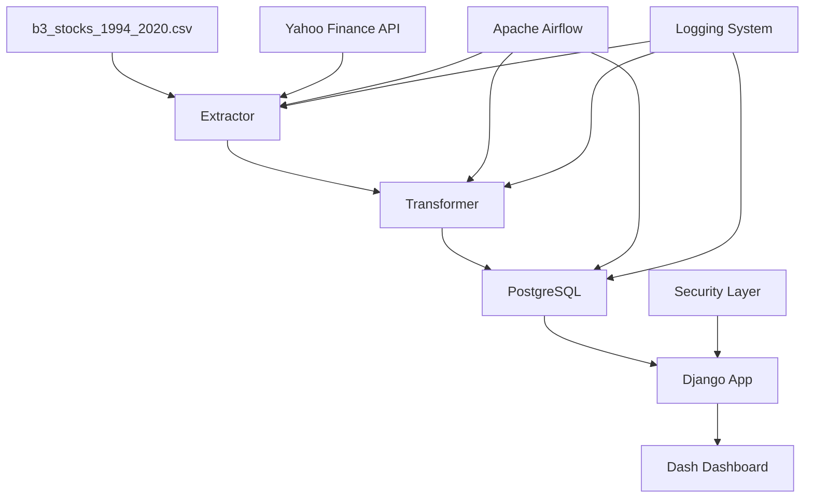

# Data Master 2 - Análise do Mercado de Ações Brasileiro (B3)

## 1. Objetivo do Projeto

Este projeto desenvolve uma solução completa de Engenharia de Dados para análise do mercado de ações brasileiro (B3), demonstrando proficiência em todo o ciclo de vida dos dados, desde a extração até a visualização. O projeto aborda requisitos de observabilidade, segurança, mascaramento de dados, arquitetura de dados e escalabilidade, sendo apresentado como trabalho de conclusão de curso de Engenharia de Dados.

### Principais Características:
- **ETL em Lote**: Processamento de dados históricos da B3 (1994-2020)
- **Integração com APIs**: Dados complementares via Yahoo Finance
- **Dashboard Interativo**: Visualização com Django e Dash
- **Orquestração**: Pipeline automatizado com Apache Airflow
- **Observabilidade**: Logging, monitoramento e alertas
- **Segurança**: Autenticação e controle de acesso

## 2. Arquitetura da Solução

### 2.1 Diagrama de Arquitetura



### 2.2 Componentes da Arquitetura

#### **Extração de Dados**
- **Dados Históricos**: Arquivo CSV com dados de 1994-2020
- **Dados Complementares**: Yahoo Finance API via yfinance
- **Estrutura**: datetime, ticker, open, close, high, low, volume

#### **Transformação (ETL)**
- **Ferramentas**: pandas, numpy
- **Operações**: Limpeza, padronização, enriquecimento, agregação
- **Indicadores**: Médias móveis, volatilidade, RSI, MACD, retornos

#### **Armazenamento**
- **Banco Principal**: PostgreSQL
- **Otimização**: Esquema para séries temporais
- **Estrutura**: Tabelas para ações, indicadores e metadados

#### **Orquestração**
- **Ferramenta**: Apache Airflow
- **Funcionalidades**: DAGs, monitoramento, agendamento
- **Observabilidade**: Logs estruturados e alertas

#### **Visualização**
- **Framework**: Django + Dash
- **Funcionalidades**: Gráficos interativos, filtros, tabelas
- **Segurança**: Autenticação e autorização

## 3. Tecnologias Utilizadas

### Backend
- **Python 3.9+**
- **Django 4.2+**
- **PostgreSQL 14+**
- **Apache Airflow 2.7+**

### Data Processing
- **pandas**: Manipulação de dados
- **numpy**: Computação numérica
- **yfinance**: API Yahoo Finance

### Visualization
- **Dash**: Dashboards interativos
- **Plotly**: Gráficos e visualizações

### Infrastructure
- **Docker**: Containerização
- **python-dotenv**: Gerenciamento de variáveis de ambiente

## 4. Estrutura do Projeto

```
DATA_MASTER_2/
├── README.md
├── requirements.txt
├── .env.example
├── docker-compose.yml
├── Dockerfile
├── data/
│   └── b3_stocks_1994_2020.csv
├── etl/
│   ├── __init__.py
│   ├── extractors/
│   ├── transformers/
│   ├── loaders/
│   └── dags/
├── dashboard/
│   ├── manage.py
│   ├── dashboard/
│   ├── apps/
│   └── static/
├── scripts/
│   ├── setup_database.py
│   └── run_etl.py
└── docs/
    ├── architecture.md
    └── api_documentation.md
```

## 5. Caso Desenvolvido

### 5.1 Implementação

O projeto foi implementado seguindo as melhores práticas de Engenharia de Dados:

1. **Modularidade**: Cada componente (extração, transformação, carga) é independente
2. **Observabilidade**: Sistema completo de logging e monitoramento
3. **Segurança**: Autenticação e controle de acesso implementados
4. **Escalabilidade**: Arquitetura preparada para crescimento
5. **Reprodutibilidade**: Docker e scripts de automação

### 5.2 Desafios Encontrados

- **Integração de APIs**: Tratamento de rate limits e falhas
- **Performance**: Otimização de queries para grandes volumes de dados
- **Visualização**: Criação de dashboards responsivos e interativos
- **Orquestração**: Configuração e monitoramento de DAGs

### 5.3 Soluções Aplicadas

- **Resiliência**: Retry mechanisms e circuit breakers
- **Cache**: Implementação de cache para queries frequentes
- **Indexação**: Otimização do banco de dados para consultas temporais
- **Componentização**: Reutilização de componentes Dash

## 6. Melhorias e Considerações Finais

### 6.1 Melhorias Futuras

1. **Streaming de Dados**: Implementação de pipeline em tempo real
2. **Machine Learning**: Modelos preditivos para análise de mercado
3. **Cloud Deployment**: Migração para AWS/GCP/Azure
4. **Data Lake**: Implementação de arquitetura data lake
5. **Real-time Analytics**: Análise em tempo real de cotações

### 6.2 Considerações de Produção

- **Monitoramento**: Implementação de APM (Application Performance Monitoring)
- **Backup**: Estratégias de backup e disaster recovery
- **Compliance**: Conformidade com regulamentações financeiras
- **Performance**: Otimização contínua de queries e processos

### 6.3 Lições Aprendidas

- Importância da observabilidade desde o início
- Necessidade de testes automatizados
- Valor da documentação clara e atualizada
- Benefícios da modularidade e reutilização de código

## 7. Reprodução do Projeto

### 7.1 Pré-requisitos

- Docker e Docker Compose
- Python 3.9+
- PostgreSQL 14+
- Git

### 7.2 Instalação

1. **Clone o repositório**:
```bash
git clone <repository-url>
cd DATA_MASTER_2
```

2. **Configure as variáveis de ambiente**:
```bash
cp .env.example .env
# Edite o arquivo .env com suas configurações
```

3. **Execute com Docker**:
```bash
docker-compose up -d
```

4. **Execute o ETL inicial**:
```bash
python scripts/run_etl.py
```

5. **Acesse o dashboard**:
```
http://localhost:8000
```

### 7.3 Desenvolvimento Local

1. **Instale as dependências**:
```bash
pip install -r requirements.txt
```

2. **Configure o banco de dados**:
```bash
python scripts/setup_database.py
```

3. **Execute o servidor Django**:
```bash
cd dashboard
python manage.py runserver
```

4. **Execute o Airflow**:
```bash
airflow standalone
```

## 8. API Documentation

### Endpoints Principais

- `GET /api/stocks/` - Lista de ações
- `GET /api/stocks/{ticker}/` - Dados de uma ação específica
- `GET /api/indicators/` - Indicadores calculados
- `GET /dashboard/` - Dashboard principal

### Autenticação

O sistema utiliza autenticação baseada em tokens JWT. Para acessar endpoints protegidos:

```bash
curl -H "Authorization: Bearer <token>" http://localhost:8000/api/stocks/
```

## 9. Contribuição

Para contribuir com o projeto:

1. Fork o repositório
2. Crie uma branch para sua feature
3. Implemente suas mudanças
4. Adicione testes
5. Submeta um pull request

## 10. Licença

Este projeto está licenciado sob a MIT License - veja o arquivo [LICENSE](LICENSE) para detalhes.

---

**Desenvolvido como trabalho de conclusão de curso de Engenharia de Dados** 