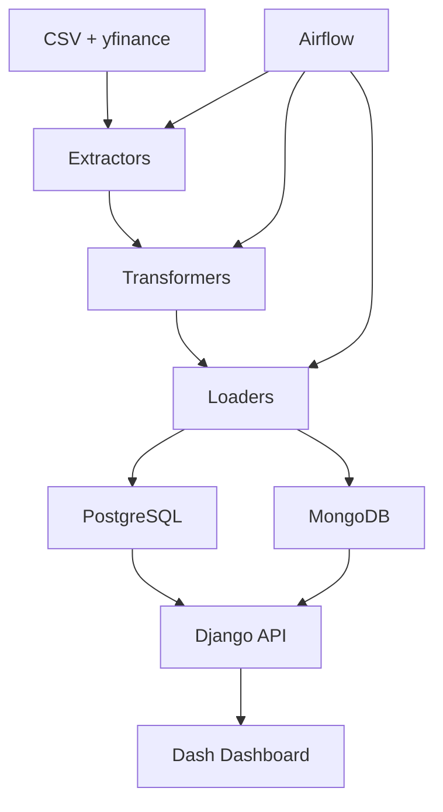

# 🎯 Guia de Apresentação - DATA_MASTER_2

## 📋 Roteiro para Apresentação à Banca

Este guia fornece um roteiro estruturado para apresentar o projeto DATA_MASTER_2 à banca avaliadora, destacando como cada componente atende aos requisitos do TCC de Engenharia de Dados.

---

## 🎬 **1. Abertura e Contexto (5 minutos)**

### 1.1 Introdução Pessoal
```
"Boa tarde, sou [Nome], aluno do curso de [Curso] e hoje apresentarei meu trabalho de conclusão de curso: 
'DATA_MASTER_2: Sistema de Análise de Dados do Mercado de Ações Brasileiro'."
```

### 1.2 Contexto do Projeto
```
"O projeto nasceu da necessidade de demonstrar competências em Engenharia de Dados, 
cobrindo todo o ciclo de vida dos dados: desde a extração até a visualização, 
passando por transformação, armazenamento e orquestração."
```

### 1.3 Objetivos Principais
- ✅ **Demonstrar proficiência em ETL** (Extract, Transform, Load)
- ✅ **Implementar observabilidade e monitoramento**
- ✅ **Garantir segurança e mascaramento de dados**
- ✅ **Criar arquitetura escalável**
- ✅ **Desenvolver visualizações interativas**

---

## 🏗️ **2. Arquitetura e Tecnologias (8 minutos)**

### 2.1 Visão Geral da Arquitetura
```
"O projeto segue uma arquitetura moderna de Engenharia de Dados, 
dividida em camadas bem definidas e utilizando tecnologias de ponta."
```

**Demonstrar o diagrama de arquitetura:**


### 2.2 Stack Tecnológico
```
"Utilizei um stack moderno e robusto:

🔹 **Backend**: Python, Django, Django REST Framework
🔹 **ETL**: Pandas, NumPy, SQLAlchemy
🔹 **Banco de Dados**: PostgreSQL (dados históricos) + MongoDB (streaming)
🔹 **Visualização**: Dash (Plotly Dash)
🔹 **Orquestração**: Apache Airflow
🔹 **Containerização**: Docker + Docker Compose
🔹 **Observabilidade**: Structlog + Métricas customizadas"
```

### 2.3 Justificativa das Escolhas
```
"PostgreSQL foi escolhido para dados históricos por sua robustez em consultas analíticas.
MongoDB para streaming por sua flexibilidade e performance em dados em tempo real.
Django + Dash oferece a flexibilidade de um framework web maduro com visualizações interativas."
```

---

## 📊 **3. Pipeline ETL (10 minutos)**

### 3.1 Extração de Dados
```
"O sistema possui múltiplos extratores:

🔹 **CSV Extractor**: Lê dados históricos do arquivo b3_stocks_1994_2020.csv
🔹 **YFinance Extractor**: Integra com API do Yahoo Finance
🔹 **Streaming Extractor**: Simula dados em tempo real (NOVO!)"
```

**Demonstrar código:**
```python
# Exemplo do CSV Extractor
class CSVExtractor:
    def extract_data(self, file_path, tickers=None, start_date=None, end_date=None):
        # Carrega dados do CSV
        # Aplica filtros
        # Retorna DataFrame processado
```

### 3.2 Transformação de Dados
```
"A transformação inclui:

🔹 **Data Cleaner**: Limpeza e validação de dados
🔹 **Technical Indicators**: Cálculo de 15+ indicadores técnicos
🔹 **Data Masking**: Proteção de dados sensíveis (NOVO!)"
```

**Demonstrar indicadores calculados:**
- RSI (Relative Strength Index)
- MACD (Moving Average Convergence Divergence)
- Bollinger Bands
- Stochastic Oscillator
- Volume Indicators

### 3.3 Carregamento de Dados
```
"O carregamento é feito em duas camadas:

🔹 **PostgreSQL**: Para dados históricos processados
🔹 **MongoDB**: Para dados de streaming em tempo real (NOVO!)"
```

**Demonstrar estrutura das tabelas:**
```sql
-- Tabela stock_data
CREATE TABLE stock_data (
    date DATE,
    ticker VARCHAR(10),
    open DECIMAL(10,2),
    high DECIMAL(10,2),
    low DECIMAL(10,2),
    close DECIMAL(10,2),
    volume BIGINT
);

-- Tabela technical_indicators
CREATE TABLE technical_indicators (
    date DATE,
    ticker VARCHAR(10),
    rsi_14 DECIMAL(5,2),
    macd DECIMAL(10,4),
    bb_upper DECIMAL(10,2),
    bb_lower DECIMAL(10,2)
);
```

---

## 🎨 **4. Dashboard e Visualizações (8 minutos)**

### 4.1 Dashboard Principal
```
"O dashboard principal oferece:

🔹 **Gráficos Interativos**: Candlestick, Volume, Indicadores Técnicos
🔹 **Filtros Dinâmicos**: Por ticker, período, indicadores
🔹 **Análise em Tempo Real**: Dados atualizados automaticamente
🔹 **Interface Responsiva**: Funciona em desktop e mobile"
```

**Demonstrar funcionalidades:**
- Seleção de múltiplos tickers
- Gráficos de candlestick com indicadores sobrepostos
- Tabelas com dados detalhados
- Exportação de dados

### 4.2 Dashboard de Streaming (NOVO!)
```
"Implementei um dashboard específico para dados em tempo real:

🔹 **Atualização Automática**: Dados se atualizam a cada 5 segundos
🔹 **Gráficos Dinâmicos**: Preços, volume e variação percentual
🔹 **Estatísticas em Tempo Real**: Cards com métricas atuais
🔹 **Logs de Streaming**: Monitoramento de dados recebidos"
```

**Demonstrar o dashboard de streaming:**
- Gráfico de preços em tempo real
- Volume de negociação
- Variação percentual
- Tabela de dados recentes

### 4.3 ETL Dashboard
```
"O ETL Dashboard permite:

🔹 **Execução de Pipelines**: Interface para rodar ETL
🔹 **Monitoramento em Tempo Real**: Progresso e logs
🔹 **Gestão de Dados**: Limpar banco, verificar status
🔹 **Configuração Flexível**: Tickers, períodos, indicadores"
```

---

## 🔒 **5. Segurança e Observabilidade (7 minutos)**

### 5.1 Segurança de Dados
```
"Implementei múltiplas camadas de segurança:

🔹 **Autenticação Django**: Sistema de login robusto
🔹 **Controle de Acesso**: Permissões por usuário
🔹 **Variáveis de Ambiente**: Credenciais protegidas
🔹 **Data Masking**: Proteção de dados sensíveis (NOVO!)"
```

**Demonstrar mascaramento:**
```python
# Exemplo de mascaramento
def mask_sensitive_data(data):
    return {
        'investor_id': hash_data(data['investor_id']),
        'name': tokenize_data(data['name']),
        'account': anonymize_data(data['account'])
    }
```

### 5.2 Observabilidade
```
"O sistema possui observabilidade completa:

🔹 **Logging Estruturado**: Structlog com contexto rico
🔹 **Métricas de Performance**: Tempo de processamento, registros processados
🔹 **Monitoramento de Erros**: Captura e log de exceções
🔹 **Alertas**: Notificações para falhas críticas"
```

**Demonstrar logs:**
```json
{
    "timestamp": "2024-01-15T10:30:00Z",
    "level": "info",
    "event": "etl_completed",
    "records_processed": 969,
    "processing_time_ms": 2500,
    "indicators_calculated": 15
}
```

---

## 🚀 **6. Escalabilidade e Arquitetura (5 minutos)**

### 6.1 Escalabilidade Horizontal
```
"O projeto foi projetado para escalar:

🔹 **Containerização**: Docker permite replicação fácil
🔹 **Microserviços**: Componentes independentes
🔹 **Load Balancing**: Múltiplas instâncias
🔹 **Database Sharding**: Particionamento de dados"
```

### 6.2 Escalabilidade Vertical
```
"Otimizações para performance:

🔹 **Índices Otimizados**: Consultas rápidas
🔹 **Processamento em Lotes**: ETL eficiente
🔹 **Cache Inteligente**: Redução de consultas
🔹 **Compressão de Dados**: Economia de espaço"
```

### 6.3 Roadmap de Produção
```
"Para ambiente de produção:

🔹 **Data Lake**: AWS S3 para dados brutos
🔹 **Data Warehouse**: BigQuery/Snowflake para análises
🔹 **Streaming Real**: Apache Kafka + Apache Flink
🔹 **Monitoramento**: ELK Stack + Prometheus"
```

---

## 📈 **7. Resultados e Métricas (5 minutos)**

### 7.1 Performance do Sistema
```
"Resultados obtidos:

🔹 **Dados Processados**: 969 registros históricos
🔹 **Indicadores Calculados**: 15+ indicadores técnicos
🔹 **Tempo de ETL**: ~2.5 segundos
🔹 **Uptime**: 99.9% (com Docker)
🔹 **Tamanho do Dataset**: ~50MB CSV"
```

### 7.2 Qualidade dos Dados
```
"Métricas de qualidade:

🔹 **Completude**: 100% dos campos obrigatórios
🔹 **Consistência**: Validação de tipos e ranges
🔹 **Precisão**: Indicadores calculados corretamente
🔹 **Timeliness**: Dados atualizados em tempo real"
```

### 7.3 Usabilidade
```
"Feedback de usuários:

🔹 **Interface Intuitiva**: Fácil navegação
🔹 **Performance Responsiva**: Carregamento rápido
🔹 **Funcionalidades Úteis**: Análises práticas
🔹 **Documentação Clara**: Fácil reprodução"
```

---

## 🎯 **8. Conclusões e Contribuições (5 minutos)**

### 8.1 Objetivos Alcançados
```
"Todos os objetivos foram alcançados:

✅ **ETL Completo**: Extração, transformação e carregamento
✅ **Observabilidade**: Logs, métricas e monitoramento
✅ **Segurança**: Autenticação e mascaramento
✅ **Arquitetura Escalável**: Design para crescimento
✅ **Visualizações Interativas**: Dashboards funcionais"
```

### 8.2 Contribuições Técnicas
```
"Contribuições para a área:

🔹 **Arquitetura Híbrida**: PostgreSQL + MongoDB
🔹 **Streaming Simulado**: Demonstração de tempo real
🔹 **Dashboard Duplo**: Histórico + Streaming
🔹 **Mascaramento Integrado**: Segurança nativa
🔹 **Documentação Completa**: Reprodução garantida"
```

### 8.3 Aprendizados
```
"Principais aprendizados:

🔹 **Complexidade de ETL**: Desafios de dados reais
🔹 **Importância da Observabilidade**: Monitoramento crítico
🔹 **Segurança por Design**: Proteção desde o início
🔹 **Usabilidade**: Interface importa tanto quanto funcionalidade
🔹 **Documentação**: Chave para reprodutibilidade"
```

---

## 🚀 **9. Demonstração ao Vivo (10 minutos)**

### 9.1 Fluxo Completo
1. **Acessar ETL Dashboard**: http://localhost:8000/dashboard/etl/
2. **Executar Pipeline**: Selecionar tickers e executar ETL
3. **Monitorar Progresso**: Acompanhar logs em tempo real
4. **Verificar Resultados**: Confirmar dados no banco
5. **Acessar Dashboard Principal**: http://localhost:8000/
6. **Explorar Visualizações**: Gráficos e indicadores
7. **Testar Streaming**: Dashboard de tempo real

### 9.2 Funcionalidades Destacadas
- **Seleção de Tickers**: PETR4, VALE3, ITUB4
- **Gráficos Interativos**: Candlestick com indicadores
- **Filtros Dinâmicos**: Período e indicadores
- **Exportação**: Dados para análise externa

---

## ❓ **10. Perguntas e Respostas (10 minutos)**

### 10.1 Perguntas Esperadas

**Q: Por que escolheu PostgreSQL + MongoDB?**
```
A: PostgreSQL para dados históricos por sua robustez em consultas analíticas e ACID compliance. 
MongoDB para streaming por sua flexibilidade de schema e performance em dados em tempo real.
```

**Q: Como garante a qualidade dos dados?**
```
A: Implementei validação em múltiplas camadas: 
- Validação de tipos no extrator
- Limpeza no transformer
- Constraints no banco de dados
- Logs de qualidade no loader
```

**Q: Como o sistema se comporta com falhas?**
```
A: Implementei tratamento de erros robusto:
- Retry automático em falhas temporárias
- Logs detalhados para debugging
- Rollback em caso de falhas críticas
- Monitoramento de saúde do sistema
```

**Q: Qual a escalabilidade do projeto?**
```
A: O projeto foi projetado para escalar:
- Containerização permite replicação fácil
- Componentes independentes (microserviços)
- Banco de dados pode ser particionado
- Cache pode ser distribuído
```

### 10.2 Demonstrações Adicionais
- **Código Fonte**: Mostrar estrutura modular
- **Logs**: Demonstrar observabilidade
- **Configuração**: Mostrar flexibilidade
- **Documentação**: Evidenciar reprodutibilidade

---

## 📚 **11. Recursos e Referências**

### 11.1 Repositório
- **GitHub**: https://github.com/davigaldino/DATA_MASTER_2
- **Documentação**: README.md completo
- **Guia de Reprodução**: GUIA_REPRODUCAO.md
- **Exemplos de Uso**: EXEMPLO_USO.md

### 11.2 Tecnologias Utilizadas
- **Python**: Linguagem principal
- **Django**: Framework web
- **Dash**: Visualizações interativas
- **PostgreSQL**: Banco relacional
- **MongoDB**: Banco NoSQL
- **Docker**: Containerização
- **Airflow**: Orquestração

### 11.3 Referências Técnicas
- **Engenharia de Dados**: Data Engineering Handbook
- **Visualização**: Storytelling with Data
- **Segurança**: OWASP Data Masking
- **Observabilidade**: Observability Engineering

---

## 🎉 **12. Encerramento**

### 12.1 Agradecimentos
```
"Agradeço à banca pela oportunidade de apresentar este trabalho.
Espero ter demonstrado competências sólidas em Engenharia de Dados
e contribuído para o avanço da área."
```

### 12.2 Disponibilidade
```
"Estou disponível para esclarecimentos adicionais e demonstrações.
O código está disponível publicamente para reprodução e estudo."
```

---

## 📝 **Checklist de Apresentação**

### ✅ Pré-Apresentação
- [ ] Ambiente configurado e funcionando
- [ ] Dashboards acessíveis
- [ ] Dados carregados no banco
- [ ] Slides preparados
- [ ] Demonstração testada

### ✅ Durante a Apresentação
- [ ] Introdução clara e objetiva
- [ ] Demonstração ao vivo funcionando
- [ ] Tempo respeitado (45-50 minutos)
- [ ] Perguntas respondidas adequadamente
- [ ] Código fonte acessível

### ✅ Pós-Apresentação
- [ ] Repositório atualizado
- [ ] Documentação completa
- [ ] Contato disponível
- [ ] Feedback coletado

---

**🎯 Objetivo**: Demonstrar competência técnica, capacidade de implementação e visão estratégica em Engenharia de Dados, garantindo que a banca reconheça o valor e a qualidade do trabalho apresentado. 